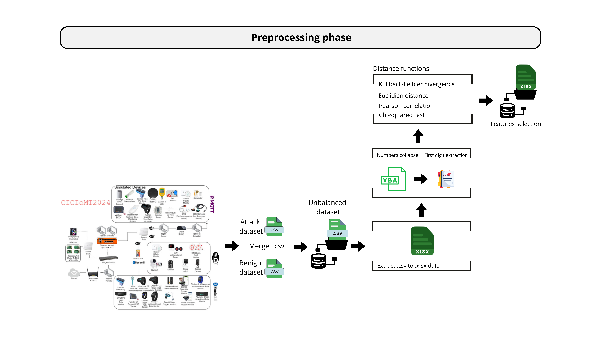

#Enhancing-IoMT-security-by-using-Benford-s-law-and-distance-functions
This study explores the application of Benford's Law and distance functions to enhance IoMT security, identifying anomalous behaviors through the analysis of numerical patterns in data flows.

+ Pedro Fernandes - Department of Computer Engineering; Technological University of the Shannon; Limerick, Ireland; Pedro.Fernandes@tus.ie ; Mathematics Department; Polytechnic Institute of Leiria; Leiria, Portugal; pedro.a.fernandes@ipleiria.pt

+ Séamus Ó Ciardhuáin - Department of Computer Engineering; Technological University of the Shannon; Limerick, Ireland; seamus.ociardhuain@tus.ie

+ Mário Antunes - Computer Science and Communication Research Centre (CIIC), School of Technology and Management, Polytechnic of Leiria; Leiria; Portugal; mario.antunes@ipleiria.pt; INESC TEC, CRACS; Porto; Portugal

#### Method based on the application of Benford's Law combined with distance functions for detecting anomalous patterns in IoT devices.

This study presents a promising methodology for detecting and analysing anomalies in IoT devices. It combines Benford's Law with various distance functions—namely the Mean Absolute Deviation (MAD), the Kolmogorov-Smirnov (KS) test, the Kullback-Leibler (KL) divergence, the Euclidean distance, and the Z statistic—as metrics for selecting and evaluating the flows extracted from these devices.
The proposed approach is implemented through multiple scripts in MATLAB, which incorporate various distance functions to extract the first digits and generate a set of tables with the results of the different distances. This allows a comparison between the frequencies of each flow and the empirical frequencies predicted by Benford's Law.
The process begins with selecting features by extracting the first digits from a dataset containing malicious and benign flows. The extracted values are stored in a database and exported to .xls format. Subsequently, the first digits are analysed using Pearson's correlation, Euclidean distance, the Chi-squared test, and Kullback-Leibler divergence to identify the most relevant characteristics.
The flows are categorised based on the p-values and the distances obtained from calculating the Kullback-Leibler and Jensen-Shannon divergences and the Z-statistic. These values are calculated by comparing the empirical distribution of the digits, according to Benford's Law, with the relative frequencies of the digits extracted from the dataset.
This methodology offers a robust approach, combining statistics and distance analysis, to distinguish benign from malicious flows in IoT devices, thus contributing to strengthening security in Internet of Things networks.

### IoT Dataset – University of New Brunswick (UNB)

This dataset was obtained from the **UNB (University of New Brunswick)** website and is available at: [https://www.unb.ca/cic/datasets/ids-2017.html](https://www.unb.ca/cic/datasets/iomt-dataset-2024.html). 

#### 📝 **Summary:**
The dataset covers various attacks targeting WiFi-enabled IoMT devices and simulated MQTT devices, grouped into four main categories:
- **DDoS:** SYN Flood, TCP Flood, ICMP Flood, UDP Flood  
- **DoS:** SYN Flood, TCP Flood, ICMP Flood, UDP Flood  
- **Recon:** Ping Sweep, Vulnerability Scan, OS Scan, Port Scan  
- **MQTT:** Malformed Data, DoS Connect Flood, DDoS Connect Flood, DoS Publish Flood, DDoS Publish Flood  

The attacks simulate real-world scenarios, varying in the number of flows per type, and include **45 features**.

#### 📊 **Labeling:**
- **Malicious flows:** Labeled as `1`  
- **37,607 benign flows:** Labeled as `0`  

#### 📧 **Contact:**
To test the model with this dataset, please contact:  
**Pedro.Fernandes@tus.ie**

### General architecture 

The pre-processing and processing phases are outlined below.

### Preprocessing and Processing Phase

#### 🛠️ **Preprocessing Phase:**
The preprocessing phase involves two main tasks:
1. **Data Aggregation:** Combining malicious and benign flow datasets using a Python script.
2. **Feature Reduction:** Excluding features with only zeros, ones, or no digits 1 to 9, as they lack the numerical variation required for Benford's Law analysis.

**📊 Feature Selection Process:**
- Features with only binary values (0 and 1) or lacking digits from 1 to 9 were removed.
- Digit collapsing was applied to extract the most significant digit.
- First-digit frequencies were calculated and compared with Benford’s Law.

**📈 Distance Function Analysis:**
Relevant features were selected based on:
- **Low values:** Kullback–Leibler divergence, Euclidean distance, Chi-square test.
- **High values:** Pearson correlation.

**💾 Output:**
- Selected features were stored in `.xlsx` files.
- Flows were labeled as `0` (benign) or `1` (malicious).

#### ⚙️ **Processing Phase:**
In the processing phase:
- Graphical comparisons between empirical digit distributions and Benford’s Law were created for each attack type.
- Various distance functions (e.g., Kullback–Leibler, Jensen–Shannon, MAD, Pearson, Kolmogorov, Z statistics) were applied to assess deviations.
- Classification labels (`0` for benign, `1` for malicious) were generated and stored in `.txt` files.
- Results were validated using confusion matrices and standard classification metrics.

### Best Performance Metrics for TCP_IP_DDoS Attacks . some results

#### 📊 **Table: Best Performance Metrics for TCP_IP_DDoS Attacks**
The table below presents the highest performance metrics obtained for TCP_IP_DDoS attacks. It includes values for False Positives (FP), False Negatives (FN), True Positives (TP), and True Negatives (TN), along with Precision (P), Recall (R), F1-Score (F1), and Accuracy (A) metrics.

| **Attack Type** | **Flows** | **Benign** | **Malicious** | **Features (Total/Selected)** | **Distance Function** | **TP** | **FN** | **FP** | **TN** | **Precision** | **Recall** | **F1 Score** | **Accuracy** |
|------------------|----------|-----------|--------------|------------------------------|---------------------|-------|-------|-------|-------|------------|---------|------------|-----------|
| TCP_IP-DDoS-UDP2 | 194,023  | 37,607   | 156,416    | 45/4                        | Kolmogorov (α=0.01)|154,460|1,956  |4,242  |33,365 |0.9733     |0.9875   |0.9803     |0.9681    |
| TCP_IP-DDoS-UDP1 | 243,261  | 37,607   | 205,654    | 45/5                        | Pearson (α=0.05)  |204,345|1,309  |9,674  |27,933 |0.9548     |0.9936   |0.9738     |0.9549    |
| TCP_IP-DDoS-SYN  | 210,004  | 37,607   | 172,397    | 45/4                        | Pearson (α=0.05)  |159,170|13,227 |18,167 |19,440 |0.8976     |0.9233   |0.9102     |0.8505    |
| TCP_IP-DDoS-ICMP1| 191,614  | 37,607   | 154,007    | 45/6                        | Kolmogorov (α=0.01)|148,973|5,034  |1,134  |36,473 |0.9924     |0.9673   |0.9797     |0.9678    |
| TCP_IP-DDoS-ICMP2| 233,299  | 37,607   | 195,692    | 45/6                        | Kolmogorov (α=0.01)|191,545|4,147  |4,647  |32,960 |0.9763     |0.9788   |0.9776     |0.9623    |

This table provides a clear comparison of performance metrics across different DDoS attack types, highlighting the effectiveness of the Kolmogorov and Pearson distance functions.

